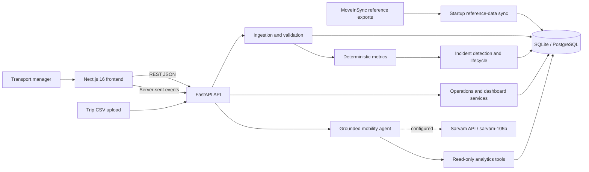

# SHLOK - Agentic Mobility Intelligence

SHLOK is a working enterprise-mobility operations prototype built for the **MoveInSync track of Bessemer Tech Catalyst 2026**. It turns trip data into deterministic service metrics, proactive incidents, operational evidence, recommended actions, and grounded conversational analysis for a transport manager.

The challenge asks for an agentic intelligence and reporting layer that can sense operational conditions, reason against context such as an SLA or historical trend, and help a mobility persona act. The original brief is available in [the MoveInSync problem statement](./MoveInSync%20-%20Anonymised%20Trip-Log%20Dataset/Dictionary/problem_explanation_7qdzf3jxklt.pdf).

## What SHLOK delivers

- **Decision support:** an operations control room with OTA, trip volume, delay impact, vendor performance, shift reliability, weekly trends, and an attention queue.
- **Proactive detection:** automatic overall OTA, vendor OTA, and GPS-availability incidents after every upload.
- **Contextual reasoning:** every official alert is evaluated against configured SLA and minimum-volume rules; the dashboard also exposes historical trends and contributing dimensions.
- **Action workflow:** incidents include evidence, recommended next actions, acknowledgment, re-notification after deterioration, recovery history, and a downloadable notification draft.
- **Conversational analysis:** a read-only mobility agent answers from the current operational snapshot or one selected incident. The deployed configuration uses Sarvam with `sarvam-105b`; without a key it falls back to deterministic grounded-local mode.
- **Messy-data handling:** the ingestion and reference-data layers normalize IDs and epochs, retain invalid/skipped-row counts, tolerate missing values, and expose data-quality warnings.

The current persona is the **transport manager**. Authentication, live vendor integrations, actual email delivery, a full historical pipeline, and external peer benchmarks are intentionally outside this prototype's scope, matching the challenge brief.

## Architecture

SHLOK is a two-application modular monolith: a browser-facing Next.js application and a FastAPI API containing the domain services and optional AI integration.



Python calculations remain the source of truth for operational metrics. The AI layer explains and recommends; it cannot acknowledge incidents or otherwise mutate operational records.

## Repository layout

```text
backend/        FastAPI application, domain services, persistence, and tests
frontend/       Next.js operations interface and typed API client
sample-data/    Small deterministic CSVs for the demo flows
MoveInSync - Anonymised Trip-Log Dataset/
                Challenge brief and source-data dictionaries
outputs/        Local generated/cleaned data; ignored and not consumed by the app
```

See [frontend/README.md](./frontend/README.md) and [backend/README.md](./backend/README.md) for component-level architecture, configuration, and commands.

## Prerequisites

- Python 3.11 or later
- Node.js 20 or later
- npm

## Run locally

Open two terminals at the repository root.

### 1. Start the backend

```powershell
Set-Location .\backend
py -3.11 -m venv .venv
.\.venv\Scripts\Activate.ps1
python -m pip install -r requirements.txt
if (-not (Test-Path .env)) { Copy-Item .env.example .env }
python -m uvicorn app.main:app --reload
```

### 2. Start the frontend

```powershell
Set-Location .\frontend
npm install
if (-not (Test-Path .env.local)) { Copy-Item .env.example .env.local }
npm run dev
```

Open <http://localhost:3000>. The API health check is at <http://localhost:8000/health> and interactive API documentation is at <http://localhost:8000/docs>.

## Demo flows

### Initial breach detection

1. Upload the first sample through Swagger at <http://localhost:8000/docs>, or run this from `backend/`:

   ```powershell
   curl.exe -F "file=@../sample-data/ota-breach-demo.csv" http://localhost:8000/api/datasets/upload
   ```

2. Open <http://localhost:3000> and review the generated overall OTA, vendor OTA, and GPS availability signals.
3. Open an incident to inspect contributing trips, the SLA gap, evidence, and the recommended action.
4. Acknowledge it and generate the notification draft.

Uploads append trips. Each `trip_id` must therefore be globally unique.

### Re-notification after deterioration

Use a fresh `backend/mobility.db`:

1. Upload `sample-data/ota-breach-demo.csv`.
2. Acknowledge the overall OTA incident at 75%.
3. Upload `sample-data/ota-critical-deterioration.csv` through the same API operation.
4. The existing incident reopens at 37.5%, increments its notification count, and requires acknowledgment again.

You can also upload `sample-data/ota-breach-evening.csv` after the first sample to demonstrate an appended batch and additional operational signals.

## Core business rules

- OTA target: **90%**.
- A trip arriving no more than five minutes late counts as on time.
- Overall OTA requires at least 10 completed trips; vendor OTA requires at least 3.
- Active incident identity is scoped to the operational rule, preventing duplicate open incidents.
- An acknowledged incident reopens after a five-percentage-point deterioration or a severity escalation.
- Recovery to the configured target resolves the active incident.
- Incident events preserve opening, escalation/reopening, acknowledgment, communication, and recovery history.

All thresholds can be changed through backend environment variables.

## Main interfaces

| Interface | Purpose |
|---|---|
| `/` | Operations health, weekly trend, priority incidents, vendor and shift performance |
| `/incidents` | Incident filtering, evidence, lifecycle, acknowledgment, and communication draft |
| `/agent` | General or incident-scoped conversational analysis |
| `/trips` | Trip-level filtering and CSV export |
| `/feedback` | Experience ratings and CSV export |
| `/safety-alerts` | Safety-event filtering and CSV export |

The principal API groups are `/api/datasets`, `/api/dashboard`, `/api/operations`, `/api/dashboards`, `/api/incidents`, `/api/agent`, and `/api/tools`.

## Current deployment configuration

The active environment is configured for:

- Neon managed PostgreSQL in AWS Asia Pacific (Singapore)
- Sarvam as the AI provider
- `https://api.sarvam.ai` as the provider base URL
- `sarvam-105b` as the agent model
- local frontend origins on port 3000

The Neon password and Sarvam API key belong only in `backend/.env` or a deployment secret manager. They are deliberately omitted from repository documentation and examples.

## Verification

```powershell
Set-Location .\backend
python -m pytest -q

Set-Location ..\frontend
npm run lint
npm run build
```

Backend tests cover metric boundaries, ingestion, incident detection and reopening, data dashboards, analytics, database URL normalization, and grounded/model-backed agent behavior.

## Deployment path

- Build and host the Next.js frontend as a Node.js web application.
- Deploy FastAPI behind an HTTPS application service or container runtime.
- Set `NEXT_PUBLIC_API_URL` to the public API origin and configure `ALLOWED_ORIGINS` accordingly.
- Replace local SQLite with managed PostgreSQL through `DATABASE_URL`.
- Keep the Sarvam credential only in backend secrets; omit it to retain deterministic local-agent mode.
- For enterprise adoption, the next architectural steps are tenant-scoped data access, authentication/authorization, background ingestion, durable notifications, observability, and managed schema migrations.

## Team SHLOK

- **S**achin
- **H**arsh
- **L**akshmi
- **O**viya
- **K**rithika
