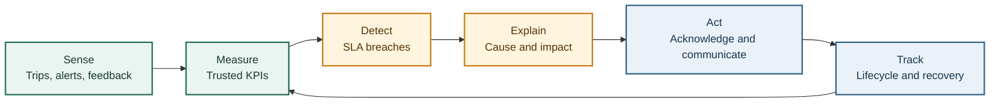
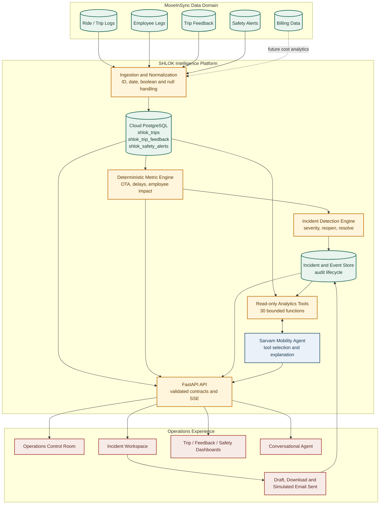
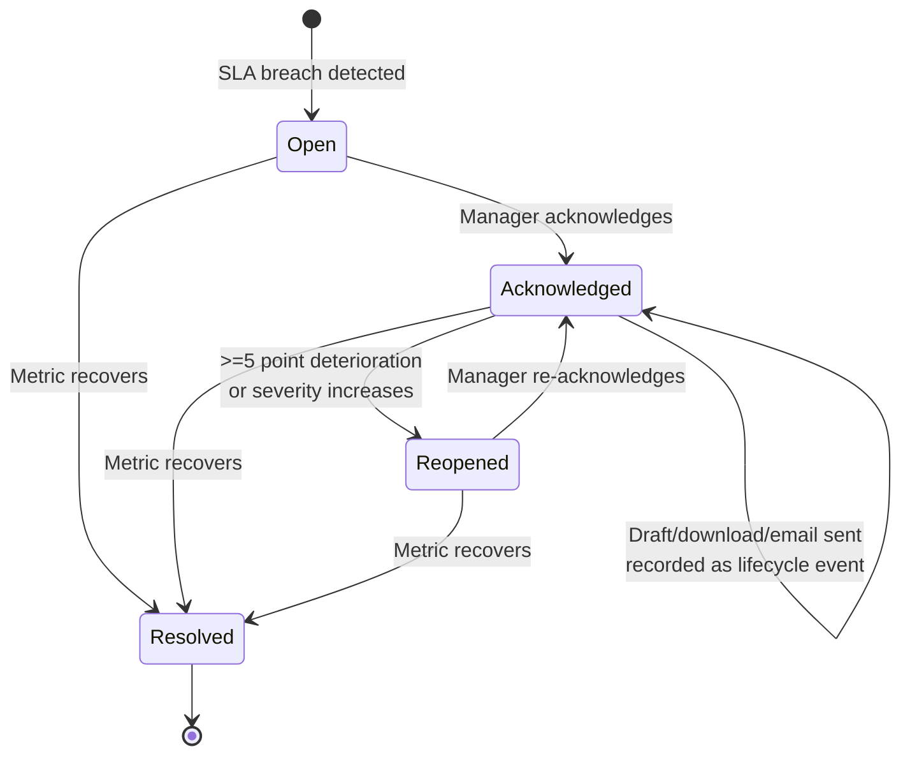
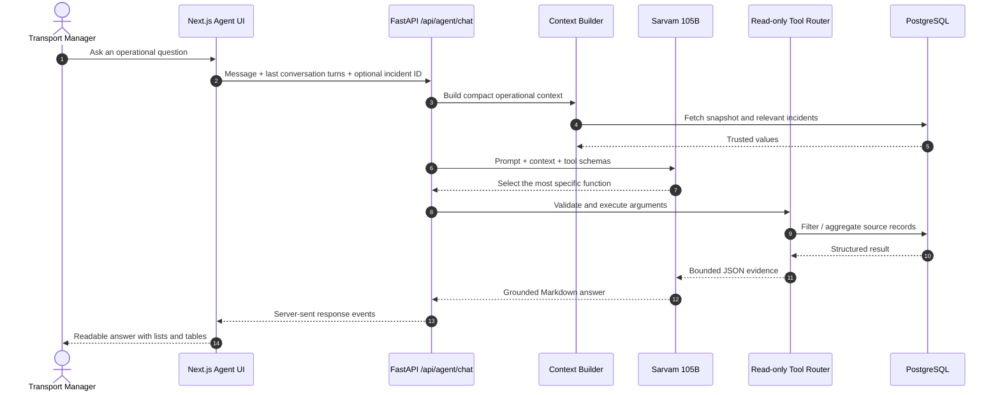

# SHLOK: Presentation and AI Video Master Document

**Project:** SHLOK Mobility Intelligence  
**Challenge:** MoveInSync, Bessemer Tech Catalyst 2026  
**Document purpose:** Source material for a pitch deck, product demo, judging conversation, and AI-generated explainer video  
**Evidence date:** 5 September 2026

> **One-line pitch**  
> SHLOK turns fragmented enterprise mobility records into a live control room that detects SLA breaches, explains who and what is affected, guides the manager to evidence, and closes the response loop through acknowledgment and accountable communication.

---

## 1. Executive Summary

Enterprise mobility teams do not lack data. They lack a fast, trusted path from data to action. Trip logs, employee movement records, safety alerts, vendor performance, feedback, and compliance signals arrive at different grains and in different formats. Managers manually combine reports, reconcile IDs, calculate performance, identify causes, contact vendors, and then reconstruct what happened for leadership.

SHLOK is an **agentic intelligence and reporting layer** for this operating gap. It combines deterministic analytics with a read-only AI agent:

1. **Sense:** Normalize trip, feedback, safety, employee-impact, and compliance data in PostgreSQL.
2. **Detect:** Calculate authoritative operational metrics and identify breaches against configured SLAs.
3. **Explain:** Connect each incident to the vendors, routes, shifts, employees, and trip-level evidence that contributed to it.
4. **Act:** Let the transport manager acknowledge an incident, create an editable vendor email draft, download it, and record a simulated sent event.
5. **Learn:** Preserve lifecycle history and provide trend, vendor, shift, feedback, and safety views for continuous improvement.

The current normalized environment demonstrates the problem at meaningful scale:

| Verified SHLOK metric | Current value | Interpretation |
|---|---:|---|
| Completed trips | 93,956 | Operational volume currently normalized in the application |
| Reported delayed trips | 8,447 | Trips where the source reports `delay_minutes > 0` |
| On-time arrival | 91.01% | Deterministically calculated operational KPI |
| Delay rate | 8.99% | $8,447 / 93,956$ |
| Employee impacts on delayed trips | 20,543 | Sum of employee count across delayed trips; not necessarily unique people |
| Average delay | 16.84 minutes | Average reported/inferred delay under the implemented rules |
| Driver non-compliance trips | 97 | Current Trips dashboard value |
| No-shows | 12,914 | Current Trips dashboard value |
| Delay exposure | about 2,371 trip-hours | $8,447 \times 16.84 / 60$; operational exposure, not a financial-loss claim |

---

## 2. Team SHLOK

The name **SHLOK** is formed from the first letters of the team members:

| Letter | Team member |
|---|---|
| **S** | Sachin |
| **H** | Harsh |
| **L** | Lakshmi |
| **O** | Oviya |
| **K** | Krithika |

**Suggested slide line:** Five builders. One operational truth. One faster path from signal to action.

> Add individual roles before the final presentation, for example Product and Research, Backend and Data, AI and Tooling, Frontend and UX, and Testing and Storytelling. The repository verifies the names, but not role ownership.

---

## 3. Problem Statement

### Formal problem statement

Enterprise employee transportation generates high-volume, multi-source operational data, but the people responsible for service reliability still depend on fragmented reports and manual investigation. This increases time to detect an SLA breach, time to identify the contributing vendor or shift, and time to coordinate corrective action. It also makes accountability difficult because the evidence, acknowledgment, communication, and recovery history live in different places.

### The operational reality

The supplied MoveInSync dataset illustrates the fragmentation:

| Source | Grain | Source rows | Why it matters |
|---|---|---:|---|
| Ride data | One cab trip | 615,546 across May-July 2026 | Timing, delay, distance, vendor, and compliance |
| Employee data | One employee leg | 1,637,906 | Boarding, no-shows, and employee impact |
| Trip feedback | One employee rating per leg | 512,873 | Route, driver, cab, safety, and marshal experience |
| Safety alerts | One alert | 51,699 | SOS, geofence, over-speeding, state, and acknowledgment |
| Billing data | One billed trip line | 620,942 | Cost, distance, vendor, contract, and slab |

The sources share a `trip_id`, but real-world quirks make direct analysis difficult: comma-formatted IDs, multiple date formats, monthly schema drift, nulls with business meaning, inconsistent booleans, negative distances, and malformed categories.

### The core gap

> The mobility system records what happened, but operations teams still need an intelligence layer that determines what matters now, why it matters, who should act, and whether action occurred.

---

## 4. Persona Pain Points: The Story Before SHLOK

### Persona 1: Transport Manager

**Opening scene:** It is 8:15 AM. The first shift has already begun. The transport manager has a trip report open in one spreadsheet, a vendor report in another, safety alerts in a third system, and several messages asking, “Why are employees late?”

**Frustrations:**

- “I have thousands of rows but no priority list.”
- “I manually filter delay reports to find the vendor and route responsible.”
- “Every team uses a slightly different definition of delayed.”
- “By the time I prepare the summary, the next shift has started.”
- “I acknowledge an issue in chat, but there is no clean lifecycle record.”
- “Writing the vendor escalation email is another repetitive manual step.”
- “I cannot instantly show the exact trips behind an incident.”

**Operational consequence:** Slow detection, inconsistent triage, repeated analysis, delayed vendor action, and weak auditability.

### Persona 2: Transport and Facilities Head

**Opening scene:** Leadership asks whether service is improving, which vendors are failing, and whether the 90% SLA is under control. The facilities head receives several reports with different totals and no common explanation.

**Frustrations:**

- “I see weekly reports after the operational window has already passed.”
- “I cannot compare vendors and shifts from one trusted view.”
- “The headline KPI does not show how many employees were affected.”
- “Averages hide critical pockets of failure.”
- “I do not know whether an incident was acknowledged, escalated, or resolved.”
- “It is difficult to connect service quality, safety, and rider feedback.”
- “I cannot defend decisions without a clear evidence trail.”

**Business consequence:** Reactive governance, weak vendor leverage, difficulty prioritizing investment, and limited confidence in management reporting.

### Persona 3: Team or Line Manager

**Opening scene:** Several employees join late. The line manager sees the productivity impact but has no direct visibility into whether transport caused it, how widespread it is, or whether mobility operations is already responding.

**Frustrations:**

- “I know employees are late, but I do not know whether this is one trip or a pattern.”
- “I spend time asking employees and transport teams for status.”
- “I cannot see which shift or office is repeatedly affected.”
- “I have no concise, evidence-based explanation for business stakeholders.”
- “I do not know whether the transport issue has an owner.”

**Business consequence:** Lost coordination time, repeated status requests, reduced trust, and avoidable disruption to team planning.

### Impacted stakeholder: Employee or Rider

Employees are not the primary operating persona in the challenge, but they experience the result: uncertain arrivals, repeated delays, safety concerns, no-show confusion, and the feeling that feedback disappears into a report.

---

## 5. Our Solution

### Product definition

**SHLOK is a mobility operations control room with deterministic incident intelligence and a grounded AI analyst.**

It does not replace MoveInSync’s transportation execution platform. It adds a management layer above operational exports and normalized records, converting high-volume data into prioritized, explainable, and auditable action.

### The product loop

### What is implemented today

- Overall mobility health with OTA, completed trips, delayed trips, employee impacts, and average delay.
- Severity-first incident priority queue.
- Deterministic incident creation for overall OTA, vendor OTA, and GPS availability.
- Warning, high, and critical severity based on SLA gap.
- Incident acknowledgment, reopening on material deterioration, escalation, resolution, and lifecycle history.
- Trip-level evidence connected to each incident with server pagination.
- Editable incident email draft, `.txt` download, simulated send, and persistent `email_sent` event.
- Weekly OTA trend, vendor delay share, and shift reliability.
- Trips, feedback, and safety dashboards with filtering, sorting, pagination, and CSV export.
- Grounded Mobility Agent with general and incident-specific scopes.
- Thirty read-only analytical tools across trips, delays, vendors, offices, shifts, safety, employee impact, no-shows, feedback, and trends.
- Safe Markdown rendering for readable AI responses.

---

## 6. Pain Point to Solution Mapping

| Persona pain point | SHLOK capability | Immediate value | Evidence in product |
|---|---|---|---|
| Too many reports and no common view | Unified PostgreSQL-backed control room | One operational source for management decisions | Operations, Trips, Feedback, and Safety dashboards |
| Manual KPI calculation | Deterministic SQL/Python analytics | Repeatable values independent of model output | 93,956 trips, 8,447 delays, 91.01% OTA |
| Conflicting delay definitions | Source-reported `delay_minutes > 0` is authoritative; timestamp fallback only when missing | Shared business semantics | Same rule used in analytics and incident detection |
| Hard to know what matters first | Severity-ranked incident queue | Focus on critical gaps before warnings | Critical, high, warning ordering |
| Manual root-cause investigation | Vendor, route, shift, reason, and related-trip evidence | Faster movement from symptom to evidence | Incident detail and paginated trip evidence |
| No employee-impact visibility | Employee count on delayed trips | Shows human impact beyond trip totals | 20,543 current employee-trip impacts |
| No auditable response trail | Persistent incident lifecycle events | Clear accountability and handoff | Opened, acknowledged, escalated/reopened, resolved, email sent |
| Repetitive vendor communication | Grounded editable email draft and download | Reduces administrative work | Draft email after acknowledgment |
| Status hidden in spreadsheets | Weekly OTA, vendor, and shift visualizations | Faster leadership review | Operations charts |
| Difficult ad hoc questions | Sarvam-powered read-only Mobility Agent | Natural-language analysis without changing source data | General and incident-scoped chat |
| Large tables are difficult to inspect | Server filters, pagination, sorting, and export | Scales operational review without loading every row in the browser | Three data dashboards |
| Safety and feedback are disconnected | Dedicated linked dashboards and agent tools | Broader service-quality view | Safety alert and rider feedback analytics |

---

## 7. End-to-End User Journey

### Before SHLOK

1. Export multiple reports.
2. Normalize IDs and dates manually.
3. Decide which delay definition to use.
4. Calculate OTA in a spreadsheet.
5. Filter vendors, routes, and shifts.
6. Find affected employees and sample trips.
7. Write a management summary.
8. Message or email the vendor.
9. Recreate the history later when someone asks what happened.

### With SHLOK

1. Open the control room.
2. See the overall KPI and severity-ranked incidents.
3. Select an incident to inspect current value, SLA, reason, recommendation, and related trips.
4. Ask the Mobility Agent a grounded follow-up question if deeper analysis is needed.
5. Acknowledge the incident.
6. Generate and edit the vendor email draft.
7. Download the email and mark it sent.
8. Return later to see the full lifecycle and whether deterioration reopened the incident.

### Suggested live demo flow

1. Start on **Operations** and call out `91.01% OTA`, `8,447 delayed trips`, and `20,543 employee impacts`.
2. Open a critical vendor incident from the priority queue.
3. Show the SLA gap, recommended action, and trip evidence.
4. Acknowledge the incident.
5. Click **Draft email**, show grounded content, and download the text file.
6. Click **Send email** and show the persistent lifecycle event.
7. Open the Mobility Agent in incident scope and ask: “Summarize this incident and recommend the next two actions.”
8. Finish on Trips, Feedback, and Safety dashboards to show the underlying evidence layer.

---

## 8. System Architecture

### Slide-ready architecture diagram

### Technology stack

| Layer | Technology | Responsibility |
|---|---|---|
| Web application | Next.js 16, React 19, TypeScript | Responsive control room, incidents, dashboards, and agent UX |
| API | FastAPI, Pydantic | Typed REST endpoints, validation, and server-sent event streaming |
| Data access | SQLAlchemy 2 | Querying, aggregation, persistence, and database portability |
| Operational store | Cloud PostgreSQL via Psycopg 3 | Normalized mobility data and incident lifecycle state |
| AI provider | Sarvam `sarvam-105b` | Natural-language reasoning and tool selection |
| AI tools | Python/SQL read-only functions | Authoritative trip, vendor, safety, employee, feedback, and trend results |
| Testing | Pytest and TypeScript compiler | API behavior, analytics rules, pagination, and frontend type safety |

### Why this architecture is trustworthy

- **Metrics are not generated by the LLM.** SQL and Python calculate official values.
- **The AI is read-only.** It cannot acknowledge incidents or alter operational records.
- **Actions use explicit APIs.** Acknowledgment and email-sent state are deterministic backend operations.
- **Lifecycle events persist.** UI state survives refresh and supports auditability.
- **Contracts are typed.** Pydantic validates API responses; TypeScript protects frontend usage.
- **Secrets remain server-side.** Database and Sarvam credentials are environment variables, never browser code.

---

## 9. Incident Intelligence

### Deterministic severity model

Severity is based on the percentage-point gap between the SLA and current performance:

$$
\text{gap} = \text{SLA} - \text{current value}
$$

| Gap below SLA | Severity |
|---:|---|
| Less than 5 percentage points | Warning |
| At least 5 and less than 15 points | High |
| At least 15 points | Critical |
| At or above SLA | Resolve active incident |

### Lifecycle logic

### Why the incident model matters

A dashboard says, “Performance is low.” An incident system adds operational meaning:

- What rule was breached?
- How far below target is it?
- What is the severity?
- Which vendor, route, or shift contributed?
- How many employee journeys were affected?
- Which trips are evidence?
- Has a manager acknowledged it?
- Was communication recorded?
- Did the metric recover or deteriorate?

---

## 10. AI and Tool-Calling Design

### What the AI does

The Mobility Agent translates a user’s question into one or more read-only analytical calls, receives structured results, and explains those results in operational language. It supports:

- **General scope:** overall health and active priorities.
- **Incident scope:** one selected incident, its SLA gap, evidence, impact, and recommended response.

### What the AI does not do

- It does not calculate the official OTA independently.
- It does not write directly to PostgreSQL.
- It does not acknowledge, resolve, or reopen incidents.
- It does not send real emails.
- It does not invent a peer benchmark when none is configured.

### Tool-call sequence

### Thirty read-only tools

| Domain | Representative capabilities |
|---|---|
| Trips | Summary, details, delayed trips, zero-delay dates, highest-delay days, statistics |
| Performance | Vendor, route, shift ranking, vendor comparison, vendor trip lookup |
| Root cause | Delay grouping by vendor, office, and shift; vendor issue summary |
| Safety | Alert list, alert detail, alerts grouped by vendor, office, and shift |
| Employees | Delay impact and no-show statistics by office or shift |
| Experience | Feedback summary and ratings grouped by vendor or office |
| Trends | Previous-period comparison, explicit period comparison, peer benchmark availability |

### Why token usage is controlled

SHLOK reduces unnecessary model context in several concrete ways:

1. **Compute, then explain.** Large trip tables remain in PostgreSQL. The model receives an aggregate or bounded result, not 93,956 raw trip rows.
2. **Specific tools.** A vendor question calls a vendor function instead of injecting every dashboard into the prompt.
3. **Bounded outputs.** List tools default to 20 records and cap results at 100; ranking tools use smaller domain-specific limits.
4. **Compact incident scope.** Incident mode sends only the selected incident rather than the full priority queue.
5. **Limited context.** General context includes at most eight attention incidents, and chat history is limited to the last ten messages.
6. **Limited tool loop.** The Sarvam integration permits at most three model rounds before stopping.
7. **Server-side streaming.** The answer is returned through server-sent events, improving perceived latency without repeatedly resending UI state.
8. **Deterministic fallback.** Without an AI key, a grounded local response is produced with zero external-model tokens.

### Important token claim for the presentation

> Say: “SHLOK minimizes tokens by keeping raw data and calculations outside the model and sending compact tool results.”

> Do not say: “SHLOK uses X tokens per question” or “costs ₹Y per query.” The current code does not persist provider token usage, prompt tokens, completion tokens, latency, or monetary cost. Adding this telemetry is a production enhancement.

### Current optimization opportunity

All 30 tool schemas are currently offered to Sarvam for each model call. A production version can add a lightweight domain router that exposes only the relevant subset, such as trip tools for a delay question or safety tools for an alert question. This would reduce schema tokens further while retaining the same deterministic execution layer.

---

## 11. Data Integrity and Responsible AI

### Business rules implemented

- The authoritative delayed condition is source-reported `delay_minutes > 0`.
- Timestamp-based delay is used only when source-reported delay is absent.
- OTA is calculated over completed trips.
- Overall OTA SLA defaults to 90%.
- GPS availability SLA defaults to 95%.
- At least 10 completed trips are required for overall OTA evaluation.
- At least 3 completed trips are required for vendor OTA evaluation.
- An acknowledged incident reopens after a five-point deterioration or severity escalation.

### Guardrails

- Read-only model tools.
- Explicit typed arguments with `additionalProperties: false`.
- Bounded result sets.
- Server-side API credentials.
- No raw HTML rendering in AI Markdown.
- Facts and recommendations separated in the system prompt.
- Null metadata must not be interpreted as a real-world outage.
- Tool results are treated as authoritative and preserved verbatim.
- Operational actions remain manager-controlled.

---

## 12. Market Analysis and Strategic Fit

### Market scale

Business Standard reported that India’s Employee Transportation Services market was valued at **₹50,350 crore ($6.1 billion) in 2023** and projected to reach **₹1,09,760 crore ($13.2 billion) by 2030**, citing Eco Mobility’s Red Herring Prospectus. This implies a market that more than doubles over seven years.

A separate 6W Research report distributed by Research and Markets projects an **8.2% CAGR during 2024-2030**, notes **59.6 million square feet of office absorption in 2023**, and cites a **15% year-over-year increase in office-sector transactions**. Different reports use different market definitions and should not be combined into one forecast, but both point to sustained demand for organized employee transportation.

### MoveInSync relevance

A Recur Club customer story describes MoveInSync as serving:

- **500,000 employees**
- **3 million monthly trips**
- **5,200+ vehicles**
- **500 EVs**

The same story positions MoveInSync as an end-to-end employee commute solution used by large technology enterprises. MoveInSync separately announced a **$15 million Series C** round led by Bessemer Venture Partners in February 2024.

These figures show why an intelligence layer matters: at millions of monthly trips, even a small percentage of delays or unresolved exceptions creates substantial operational investigation volume.

### Strategic fit with MoveInSync

| MoveInSync platform value | SHLOK extension |
|---|---|
| Digitized employee commute execution | Management intelligence over operational outcomes |
| Routing, tracking, fleet, and ride workflows | SLA detection, incident prioritization, and evidence |
| High-volume trip ecosystem | Cross-domain analysis across trip, employee, safety, and feedback records |
| Enterprise mobility operations | Leadership-ready trends and auditable response workflows |
| Data-rich platform | Grounded conversational analysis through read-only tools |

### Competitive differentiation

SHLOK should not be positioned as another static BI dashboard. Its differentiation is the closed operational loop:

1. Deterministic KPI and breach detection.
2. Evidence-linked incident generation.
3. Human acknowledgment.
4. Grounded communication draft.
5. Persistent action history.
6. Conversational follow-up over the same trusted data.

### Business value pillars

| Value pillar | Mechanism | KPI to measure in a pilot |
|---|---|---|
| Faster detection | Automatic SLA evaluation | Mean time to detect |
| Faster investigation | Pre-linked vendor, route, shift, and trip evidence | Mean time to understand/root-cause |
| Faster response | Recommended action, acknowledgment, and draft communication | Mean time to acknowledge and notify |
| Better accountability | Persistent lifecycle events | % incidents with owner/action trail |
| Better vendor governance | Vendor OTA, delay share, and issue evidence | Repeat breach rate by vendor |
| Lower reporting effort | Unified dashboards and CSV exports | Analyst hours saved per reporting cycle |
| Better employee experience | Employee impact, feedback, and safety visibility | Delay impact, low ratings, alert response time |
| Lower AI cost and risk | Read-only bounded tools and deterministic metrics | Tokens/query, cost/query, grounded-answer rate |

---

## 13. ROI Model for a Pilot

Use this model in the presentation instead of inventing savings. Replace assumptions with pilot measurements.

### A. Investigation-time savings

$$
\text{Monthly hours saved} = \frac{I \times (T_m - T_s)}{60}
$$

Where:

- $I$ = incidents investigated per month
- $T_m$ = average manual investigation minutes
- $T_s$ = average SHLOK-assisted investigation minutes

$$
\text{Annual operations value} = \text{Monthly hours saved} \times 12 \times C_h
$$

Where $C_h$ is the fully loaded hourly cost of the operations team.

### B. Avoided delay exposure

$$
\text{Employee delay hours avoided} = A \times R \times \frac{D}{60}
$$

Where:

- $A$ = employee-trip impacts
- $R$ = reduction in affected employee trips after intervention
- $D$ = average minutes of delay avoided

Do not multiply SHLOK’s current `20,543` employee impacts by the simple trip average and present it as exact productivity loss; employee counts and delay duration require trip-level weighting for a rigorous estimate.

### C. Reporting automation

$$
\text{Reporting hours saved} = N_r \times (H_b - H_a)
$$

Where:

- $N_r$ = reports per month
- $H_b$ = hours per report before SHLOK
- $H_a$ = hours per report after SHLOK

### Pilot scorecard

Measure a four-to-eight-week baseline and assisted period:

- Mean time to detect.
- Mean time to acknowledge.
- Mean time to vendor notification.
- Mean investigation time.
- Percentage of incidents with complete evidence.
- Percentage of repeat SLA breaches.
- Reporting hours per week.
- Sarvam prompt/completion tokens and cost per resolved question.
- User-rated answer usefulness and factual accuracy.

---

## 14. Suggested 16-Slide Deck

### Slide 1: Title

**On screen**

- SHLOK
- From mobility data to accountable action
- Team SHLOK | Bessemer Tech Catalyst 2026 | MoveInSync Track

**Speaker note**  
“MoveInSync already creates a rich operational record. SHLOK turns that record into a control room that senses issues, explains their impact, and guides action.”

**Visual**  
Use a full-width screenshot of the Operations control room with the four KPIs visible.

### Slide 2: The morning operations problem

**On screen**

- Thousands of trip rows
- Multiple reports and formats
- One urgent question: what needs action now?

**Speaker note**  
“A transport manager’s problem is not access to data. It is the time spent reconciling reports before a decision can be made.”

**Visual**  
Messy spreadsheet/report montage transitioning into the SHLOK priority queue.

### Slide 3: Three personas, one visibility gap

**On screen**

- Transport Manager: triage and response
- Transport and Facilities Head: governance and trends
- Team Manager: employee impact and status

**Speaker note**  
“Each persona sees a different symptom, but all are missing a shared operational truth.”

### Slide 4: Data complexity is the hidden blocker

**On screen**

- 615,546 source trip rows
- 1.64 million employee legs
- 512,873 feedback rows
- 51,699 safety alerts
- IDs, dates, nulls, and types that do not naturally align

**Speaker note**  
“The challenge dataset behaves like real enterprise data: large, linked, and imperfect.”

### Slide 5: Our solution

**On screen**

- Sense
- Detect
- Explain
- Act
- Track

**Speaker note**  
“SHLOK is an intelligence and response layer, not just a visualization layer.”

**Visual**  
Use the product-loop diagram from Section 5.

### Slide 6: Live operational truth

**On screen**

- 93,956 completed trips
- 8,447 delayed trips
- 91.01% OTA
- 20,543 employee-trip impacts

**Speaker note**  
“These are computed from the current normalized database, not generated by AI.”

### Slide 7: From breach to incident

**On screen**

- SLA-aware severity
- Vendor, route, shift, and employee impact
- Related trip evidence
- Reopen on material deterioration

**Speaker note**  
“A low KPI becomes a managed operational object with evidence and lifecycle.”

### Slide 8: Human-controlled action

**On screen**

- Acknowledge
- Review recommendation
- Draft and edit vendor email
- Download and mark sent
- Preserve lifecycle event

**Speaker note**  
“The manager remains in control. AI assists explanation; explicit APIs perform actions.”

### Slide 9: One evidence layer, three dashboards

**On screen**

- Trips: delay, compliance, no-shows, employee impact
- Feedback: rider experience by dimension
- Safety: state, severity, response time, trip context

**Speaker note**  
“Every summary can be traced back to filtered records and exported for follow-up.”

### Slide 10: Mobility Agent

**On screen**

- General and incident scope
- Sarvam 105B
- 30 read-only tools
- Markdown answers with tables

**Speaker note**  
“The model chooses the question-specific tool; SQL and Python return the authoritative answer.”

### Slide 11: AI without sending the database to the model

**On screen**

- Raw rows stay in PostgreSQL
- Compact context
- Bounded JSON tool outputs
- Last 10 messages only
- Maximum 3 model rounds
- Zero-token local fallback when AI is unavailable

**Speaker note**  
“This is how we control cost and hallucination risk. We do not claim an exact token saving until telemetry is added.”

### Slide 12: Architecture

**On screen**  
Use the architecture diagram from Section 8.

**Speaker note**  
“Deterministic services own truth and state. Sarvam is a read-only reasoning layer. The browser receives typed APIs and streamed answers.”

### Slide 13: Market opportunity

**On screen**

- ₹50,350 crore India ETS market in 2023
- ₹1,09,760 crore projected by 2030
- MoveInSync ecosystem reference: 500,000 employees and 3 million monthly trips

**Speaker note**  
“At this scale, reducing investigation and response time is a repeatable enterprise value proposition.”

### Slide 14: Business value

**On screen**

- Faster detection
- Faster root-cause investigation
- Faster vendor response
- Better auditability
- Better employee experience

**Speaker note**  
“Our pilot should measure time-to-detect, time-to-acknowledge, time-to-notify, repeat breaches, and reporting hours saved.”

### Slide 15: Future roadmap

**On screen**

- Real email and collaboration integrations
- Predictive SLA risk and anomaly detection
- Cost, billing, occupancy, and carbon intelligence
- Role-based access, SSO, and multi-tenancy
- AI token and quality observability

### Slide 16: Closing

**On screen**

> From “What happened?” to “Here is the incident, the evidence, the owner, and the next action.”

**Speaker note**  
“SHLOK gives every mobility signal an accountable path to action.”

---

## 15. AI Video Storyboard and Narration

### Recommended format

- **Length:** 120 seconds
- **Aspect ratio:** 16:9 for presentation; create a second 9:16 crop for social sharing
- **Style:** Enterprise operations documentary, clean data overlays, realistic Indian corporate transport setting
- **Palette:** Deep green, white, amber, muted red, and steel blue to match the product
- **Voice:** Calm, credible, operational, not futuristic or exaggerated
- **Music:** Restrained rhythmic pulse that becomes more confident after the solution reveal

### Scene-by-scene script

| Time | Visual direction | Voiceover | On-screen text |
|---:|---|---|---|
| 0-10s | Early morning office transport desk. Multiple spreadsheets, messages, and reports. Manager switches windows rapidly. | “Every morning, enterprise mobility teams receive thousands of trip records, alerts, ratings, and vendor reports.” | Too much data. Too little decision time. |
| 10-20s | Close-ups of inconsistent IDs, date formats, null cells, and report tabs. | “But before they can act, they must reconcile formats, calculate performance, and search manually for the reason behind a delay.” | Manual reconciliation. Manual analysis. Manual follow-up. |
| 20-30s | Employees arrive late; a line manager checks the clock; facilities leadership asks for status. | “The transport manager feels the pressure. Leadership lacks one trusted answer. Team managers see the impact, but not the cause or owner.” | One issue. Three frustrated personas. |
| 30-38s | Visual resets into a clean SHLOK Operations screen. | “SHLOK changes that.” | SHLOK Mobility Intelligence |
| 38-52s | Animate the four KPI cards and weekly trend. | “It transforms operational records into trusted metrics: ninety-three thousand nine hundred fifty-six trips, eight thousand four hundred forty-seven reported delays, ninety-one point zero one percent on-time arrival, and more than twenty thousand employee-trip impacts.” | Trusted metrics, calculated outside AI |
| 52-66s | Priority incident opens. Highlight severity, SLA gap, reason, recommended action, and related trips. | “When an SLA is breached, SHLOK creates a severity-ranked incident and connects it to the vendor, shift, employee impact, and exact trip evidence.” | Detect. Explain. Prioritize. |
| 66-78s | Manager clicks Acknowledge, opens Draft Email, edits subject, downloads, and marks sent. | “The manager acknowledges the incident, reviews the recommended action, drafts the vendor communication, and records the response in one auditable lifecycle.” | Acknowledge -> Communicate -> Track |
| 78-94s | Mobility Agent question appears; a tool call travels to PostgreSQL; a concise Markdown response returns. | “For deeper questions, the Sarvam-powered Mobility Agent calls one of thirty read-only analytical tools. Raw trip data stays in PostgreSQL. The model receives only compact, relevant evidence.” | Read-only AI. Bounded tools. Grounded answers. |
| 94-106s | Architecture layers animate: data, deterministic engine, incidents, tools, AI, UI. | “Deterministic services own the metrics and actions. AI helps people understand them. This keeps the system explainable, efficient, and human-controlled.” | AI explains. Managers decide. APIs act. |
| 106-116s | Market numbers animate beside office commute footage and fleet operations. | “In an Indian employee transportation market projected to exceed one lakh crore rupees by 2030, faster detection and response can create value at enormous scale.” | ₹1.09 trillion projected ETS market by 2030 |
| 116-120s | SHLOK logo over the incident timeline completing. | “SHLOK: from mobility data to accountable action.” | Sense. Detect. Explain. Act. |

### Generative visual prompts

**Opening prompt**  
“Realistic Indian enterprise transport operations control room at 8 AM, transport manager at desk with several spreadsheet reports and incoming operational messages, professional office environment, natural lighting, restrained corporate documentary style, no futuristic holograms, 16:9.”

**Problem montage prompt**  
“Fast editorial montage of transport trip spreadsheets, inconsistent date formats, vendor reports, alert notifications, employee late-arrival messages, clean legible data motifs, Indian corporate mobility context, realistic, muted neutral colors, 16:9.”

**Solution transition prompt**  
“Messy reports smoothly consolidate into a modern enterprise mobility control room interface, deep green, white, amber and steel blue palette, crisp operational charts, no neon, no sci-fi effects, premium SaaS documentary aesthetic, 16:9.”

**Architecture prompt**  
“Elegant layered data architecture animation: mobility data sources flow into cloud PostgreSQL, deterministic analytics detect incidents, read-only tools connect to a grounded AI assistant, results appear in operations dashboards, clean isometric motion graphics, deep green and amber accents, white background, 16:9.”

**Closing prompt**  
“Transport manager confidently reviews resolved incident timeline while employee shuttle arrivals operate smoothly outside a modern Indian technology campus, realistic optimistic corporate film, early morning light, understated, 16:9.”

### AI-video production notes

- Use real product screen recordings for all SHLOK UI scenes; do not ask a video model to recreate readable dashboards.
- Use generated footage only for contextual human scenes and transitions.
- Keep each generated shot three to five seconds to reduce visual drift.
- Add metrics and labels in the video editor, not inside generated footage.
- Avoid claiming a real email was delivered; the current implementation records a simulated sent state.
- Pronounce SHLOK as “shloke.”

---

## 16. Future Enhancements

### Phase 1: Production readiness

- Connect actual email delivery through Microsoft Graph, Gmail, or an enterprise mail relay.
- Add approval policy, recipient directory, delivery status, retry, and immutable message audit.
- Add SSO, role-based access control, tenant isolation, and per-persona views.
- Add incident owner, due time, comments, attachment, and escalation matrix.
- Add structured observability for API latency, tool latency, errors, and database query performance.
- Capture Sarvam prompt tokens, completion tokens, total tokens, latency, and estimated cost.

### Phase 2: Predictive intelligence

- Predict likely SLA breaches before the shift closes.
- Detect unusual vendor, route, shift, and delay-reason patterns.
- Forecast employee impact and operational capacity risk.
- Recommend interventions based on historical recovery outcomes.
- Add semantic search over operating procedures and vendor contracts.
- Evaluate grounded-answer accuracy through a curated question set.

### Phase 3: Closed-loop operations

- Integrate directly with MoveInSync APIs or event streams instead of batch exports.
- Open and synchronize tickets in ServiceNow, Jira, or an internal command center.
- Notify owners through Microsoft Teams, Slack, WhatsApp, SMS, or push channels.
- Receive vendor acknowledgment and recovery ETA back into the incident timeline.
- Auto-close incidents only after deterministic recovery validation and policy checks.

### Phase 4: Broader business intelligence

- Normalize billing data for cost per trip, route, vendor, seat, and employee journey.
- Detect invoice anomalies and contract-slab variance.
- Add capacity utilization, occupancy, dead kilometers, and route optimization.
- Add EV utilization, energy, and carbon reporting.
- Benchmark business units and vendors after a governed peer dataset is available.
- Build executive scorecards for cost, reliability, safety, experience, and sustainability.

---

## 17. Honest Product Boundaries

Use these statements in Q&A to establish credibility:

- The current email flow creates an editable downloadable draft and records a simulated sent event; it does not contact an external email provider.
- The AI tools are read-only. Incident mutations happen only through explicit manager actions and backend APIs.
- The application currently normalizes selected operational tables; billing intelligence is a future extension.
- `20,543 employees affected` is a sum of employee count across delayed trips and can include repeated journeys by the same employee.
- The current application has no token-cost telemetry, so token efficiency is architectural rather than an experimentally quantified claim.
- Peer benchmarking correctly reports unavailable until an external governed benchmark is configured.
- Market forecasts come from third parties with different definitions and methodologies; cite each independently.

---

## 18. Judge Q&A Preparation

### Why is this agentic rather than just a dashboard?

SHLOK senses operational state, detects a breach, grounds a reasoning agent in live data through tools, recommends action, supports a manager-controlled response, and tracks the lifecycle. The model can decide which analytical tool is needed, but cannot mutate operations.

### Why not let the LLM calculate OTA?

Official metrics need repeatability, testability, and auditability. SHLOK calculates OTA in deterministic SQL/Python services and asks the model only to select tools and explain returned facts.

### How do you prevent hallucinations?

The system prompt limits claims to supplied context and tool results; tools are typed and read-only; unknown peer data returns an explicit unavailable state; list outputs are bounded; and operational facts are preserved verbatim.

### How do you reduce token usage?

Raw rows remain in PostgreSQL, tools aggregate server-side, only bounded JSON results are returned, incident scope is compact, history is capped at ten messages, and the tool loop stops after three rounds. Exact savings will be measured after token telemetry is added.

### What happens if Sarvam is unavailable?

The application can produce a deterministic grounded-local response from the current snapshot with no external model call. Dashboards, incidents, acknowledgment, evidence, and email drafting remain available.

### Can the AI change or acknowledge an incident?

No. Agent tools are read-only. Acknowledgment and email-sent state require explicit API actions initiated by the manager.

### How does SHLOK scale beyond this dataset?

Filtering, aggregation, sorting, and pagination run server-side against PostgreSQL. The browser receives only the required page or summary. Production scaling would add query profiling, materialized aggregates, caching, workers, and event-driven ingestion.

### What is the strongest next integration?

MoveInSync event/API ingestion plus enterprise identity and actual email or Teams delivery. That closes the gap between demonstrated intelligence and production workflow execution.

---

## 19. Source and Evidence Notes

### Repository evidence

- `README.md`: challenge, team names, initial product framing, calculation rules, and AI concept.
- `MoveInSync - Anonymised Trip-Log Dataset/Dictionary/README.md`: source table sizes, date coverage, joins, data-quality quirks, and challenge personas.
- `backend/app/database/models.py`: normalized data and incident lifecycle models.
- `backend/app/services/data_dashboards.py`: server-side dashboard filtering, pagination, summaries, and source delay semantics.
- `backend/app/services/detection.py`: deterministic incident severity, reopening, escalation, and resolution.
- `backend/app/services/agent.py`: compact context, Sarvam function calling, last-ten-message history, three-round tool loop, deterministic fallback, and SSE response.
- `backend/app/services/agent_tools.py`: 30 read-only tools and bounded parameters.
- `backend/app/main.py`: typed routes, data exports, agent endpoint, acknowledgment, email draft, and sent-event APIs.
- `frontend/app/page.tsx`: Operations control room.
- `frontend/app/incidents/page.tsx`: incident evidence, lifecycle, acknowledgment, and communication workflow.
- `frontend/app/components/data-dashboard.tsx`: Trips, Feedback, and Safety dashboards.

### External market sources

1. **Business Standard, 25 August 2024:** “India's corporate mobility market thrives amidst rising demand: Report.” Reports the Indian ETS market at ₹50,350 crore in 2023 and projected ₹1,09,760 crore by 2030, citing Eco Mobility’s Red Herring Prospectus.  
   https://www.business-standard.com/industry/news/india-s-corporate-mobility-market-thrives-amidst-rising-demand-report-124082500135_1.html

2. **Research and Markets / 6W Research, August 2024:** “India Employee Transportation Service Market (2024-2030).” Reports projected 8.2% CAGR for 2024-2030, 59.6 million square feet of 2023 office absorption, and organized-segment drivers.  
   https://www.researchandmarkets.com/reports/5998222/india-employee-transportation-service

3. **Recur Club customer story:** Describes MoveInSync’s network as serving 500,000 employees through 3 million monthly trips, with 5,200+ vehicles including 500 EVs. Treat this as a partner/customer-story claim rather than audited market data.  
   https://www.recurclub.com/customer-showcase/how-moveinsync-attained-240-growth-in-10-months

4. **MoveInSync funding announcement, 13 February 2024:** Announces a $15 million Series C led by Bessemer Venture Partners.  
   https://moveinsync.com/blog/milestone-unlocked-moveinsync-raises-15-million-funding

### Evidence classification for slides

- **Product metrics:** Verified from the current SHLOK runtime/database.
- **Source row counts:** Verified from the supplied MoveInSync dataset dictionary.
- **Market figures:** Third-party or company-published claims; always show source and year.
- **ROI:** Formula and hypothesis until measured in a controlled pilot.

---

## 20. Final Closing Narrative

“Enterprise mobility teams already have the records. What they need is operational clarity. SHLOK transforms fragmented trip, employee, safety, and feedback data into trusted metrics and severity-ranked incidents. It shows the exact evidence, keeps the manager in control of acknowledgment and communication, and uses Sarvam through bounded read-only tools to answer deeper questions without asking AI to invent the truth. The result is a faster, more accountable path from mobility signal to business action.”
