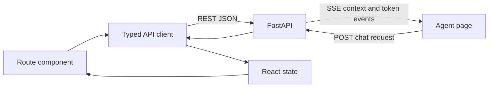

# SHLOK Frontend

The frontend is a responsive **Next.js 16 App Router** application for transport managers. It presents operational health, incident workflows, mobility-data dashboards, and a streaming conversational agent backed by the SHLOK FastAPI API.

## Technology

- Next.js 16.3
- React 19.2
- TypeScript
- CSS Modules and global CSS
- Lucide React icons
- React Markdown with GitHub-flavored Markdown support

## Prerequisites

- Node.js 20 or later
- npm
- The SHLOK backend running locally or at a reachable URL

## Setup

```powershell
Set-Location .\frontend
npm install
if (-not (Test-Path .env.local)) { Copy-Item .env.example .env.local }
npm run dev
```

Open <http://localhost:3000>.

For Bash-compatible shells:

```bash
cd frontend
npm install
cp .env.example .env.local
npm run dev
```

## Configuration

| Variable | Default | Purpose |
|---|---|---|
| `NEXT_PUBLIC_API_URL` | `http://localhost:8000` | Base URL of the FastAPI backend |

Because the browser calls FastAPI directly, the frontend origin must also appear in the backend's `ALLOWED_ORIGINS` setting.

## Routes

| Route | Screen |
|---|---|
| `/` | Operations control room with OTA, volumes, delays, weekly trend, incident queue, vendor performance, and shift reliability |
| `/incidents` | Incident lifecycle, filters, evidence, acknowledgment, history, and email-draft workflow |
| `/agent` | General or incident-scoped mobility agent with streamed responses |
| `/trips` | Paginated trip dashboard with filters and CSV export |
| `/feedback` | Paginated feedback dashboard with rating filters and CSV export |
| `/safety-alerts` | Paginated alert dashboard with operational filters and CSV export |

## Structure

```text
app/
  api/client.ts                 Shared API types, REST client, and SSE parser
  components/
    data-dashboard.tsx          Shared trips/feedback/alerts dashboard
    mobile-nav.tsx              Responsive primary navigation
  agent/page.tsx                Conversational agent workspace
  incidents/page.tsx            Incident workflow
  trips/page.tsx                Trip dashboard route
  feedback/page.tsx             Feedback dashboard route
  safety-alerts/page.tsx        Safety dashboard route
  layout.tsx                    Root document layout
  page.tsx                      Operations control room
  globals.css                   Global design tokens and base styles
```

Pages that load live data are client components. They call the typed functions in `app/api/client.ts`; this repository does not use a Next.js proxy or backend-for-frontend layer.

## Data flow



The agent page uses an `AbortController` so a user can stop a streamed answer. Agent responses are rendered as Markdown, while operational changes such as incident acknowledgment use explicit API actions.

## Available scripts

| Command | Purpose |
|---|---|
| `npm run dev` | Start the development server |
| `npm run lint` | Run ESLint |
| `npm run build` | Create a production build and run framework checks |
| `npm run start` | Serve an existing production build |

## Production

```powershell
$env:NEXT_PUBLIC_API_URL = "https://api.example.com"
npm run build
npm run start
```

`NEXT_PUBLIC_API_URL` is embedded into the browser bundle at build time. Use HTTPS in production and configure the same frontend origin in the backend CORS allowlist.

## Related documentation

- [Project overview and demo](../README.md)
- [Backend setup and API](../backend/README.md)
- [MoveInSync problem statement](../MoveInSync%20-%20Anonymised%20Trip-Log%20Dataset/Dictionary/problem_explanation_7qdzf3jxklt.pdf)
